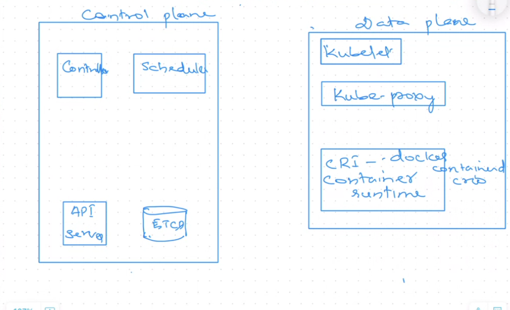

# Kubernetes Introduction 

Kubernetes is a **container orchestrator** responsible for managing containers at scale.
It ensures that containers are deployed, scheduled, scaled, networked, and maintained automatically across a cluster of machines.

---

# 1. What Kubernetes Does (Core Responsibilities)

Kubernetes orchestrates containers by providing several core features:

## 1.1 Automatic Bin Packing

* In Kubernetes, we do not directly create containers.
* Kubernetes schedules **pods**, and pods internally contain containers.
* Kubernetes automatically decides:

  * On which node a pod should run
  * Optimal resource utilization
  * Efficient packing of workloads

## 1.2 Failover and Self-Healing

* If a pod is created and then crashes or becomes unhealthy:

  * Kubernetes automatically replaces it.
  * A new pod will be created, possibly on a different node.
* This ensures that the **desired state = actual state**.

## 1.3 Scaling (Automatic and Manual)

Kubernetes supports three types of scaling:

1. Horizontal Pod Autoscaling (HPA) – scaling based on CPU/Memory metrics.
2. Vertical Pod Autoscaling (VPA) – adjusting resource requests/limits.
3. Cluster Autoscaler – adding or removing nodes automatically.

## 1.4 Load Balancing and Service Discovery

* Kubernetes Services provide stable endpoints for accessing pods.
* Kubernetes load-balances traffic across pods.
* Service discovery allows pods to find each other using:

  * DNS names
  * Virtual IPs (ClusterIP)

## 1.5 Jobs and CronJobs

* Kubernetes supports **Jobs** for finite work or background tasks.
* Supports **CronJobs** for scheduled tasks (similar to Linux cron).

## 1.6 Secrets Management

* Kubernetes can securely store and manage:

  * Passwords
  * Tokens
  * Certificates
* Secrets are mounted into pods or injected as environment variables.

---

# 2. Kubernetes Architecture

A Kubernetes cluster consists of **two types of nodes**:

1. **Control Plane (Master Node)**
2. **Worker Nodes (Data Plane)**

Important point:
**Pods are always created on the worker nodes.**
The master node only manages and coordinates pod creation.

The architecture diagram you referred to:


---

# 3. Control Plane Components

The control plane contains the following major services:

## 3.1 API Server

The API server is the central entry point for all Kubernetes operations.

Responsibilities:

* Accept REST requests from kubectl or any client
* Authentication (verifying the identity of the user)
* Authorization (checking permissions)
* Validation (schema checking)
* Admission control
* Communicates with the etcd database (CRUD on cluster objects)
* Notifies other components (scheduler, controller) about changes

Everything in Kubernetes happens through the API server.

## 3.2 etcd

* A distributed key-value store
* Stores the entire cluster state

  * Nodes
  * Pods
  * ConfigMaps
  * Secrets
  * Deployments, etc.
* etcd is the **source of truth** for Kubernetes.

## 3.3 Scheduler

* Decides **which node** a pod will run on.
* The scheduler does not run pods; it only decides placement.
* Decisions are based on:

  * Resource availability (CPU, RAM)
  * Taints and tolerations
  * Node affinity / anti-affinity
  * Pod topology constraints

## 3.4 Controller Manager

* Ensures **desired state = actual state**.
* Example controllers:

  * Node controller
  * Deployment controller
  * ReplicaSet controller
  * Job controller
* If a pod is deleted or crashes:

  * Controller replaces it to reach the specified desired state.

---

# 4. Worker Node (Data Plane) Components

Worker nodes are where the application workload actually runs.


"All the things of data plane are present in the control plane as well."

Worker node contains:

## 4.1 Kubelet

* Agent running on every worker node.
* Communicates with API server.
* Receives instructions:

  * Create pod
  * Delete pod
  * Update pod
* Passes instructions to the container runtime (CRI).
* Reports health and status back to API server.

## 4.2 Kube-Proxy

* Maintains network rules on worker nodes.
* Manages IP tables or IPVS rules.
* Responsible for internal load balancing between pods.
* Ensures service-to-pod traffic routing.

## 4.3 Container Runtime

* Responsible for running containers.
* Popular runtimes:

  * containerd
  * CRI-O
  * Docker (deprecated directly, but Docker > containerd still works)
* Kubelet interacts with the runtime using the CRI (Container Runtime Interface).

---

# 5. How Kubernetes Handles a Request


1. You run:

   ```
   kubectl run diptippod --image=nginx
   ```
2. kubectl makes a REST request to **API server**.
3. API server:

   * Authenticates the request
   * Authorizes access
   * Validates the manifest
4. API server writes the pod object into **etcd**.
5. Scheduler detects an **unscheduled pod** and selects a worker node.
6. Scheduler updates pod status in etcd with the selected node.
7. API server notifies **kubelet** on that worker node.
8. Kubelet instructs the **container runtime** to create containers inside the pod.
9. Pod begins running on the worker node.
10. Controllers continuously compare:

    * desired state → pod should exist
    * actual state → pod is running
11. If pod crashes:

    * Controller recreates it on the same or different node.

---

# 6. What is a Pod?

A **pod is the smallest deployable unit** in Kubernetes.

my note:

> group of two or more containers

More detail:

* A pod can have one or multiple tightly coupled containers.
* Containers inside the same pod share:

  * Network namespace
  * Storage volumes
  * IPC namespace
* They communicate via localhost.

Pods are not intended to be durable; they are disposable objects.
Higher-level objects like Deployments maintain pod replicas.

---

# 7. Commands from Your Class Session

## Set hostname

```
sudo su
set-hostname control-plane
```

## Check nodes

```
kubectl get node
```

## Create pod

```
kubectl run diptippod --image=nginx
```

## Describe pod

```
kubectl describe pod diptippod
```

---

# 8. Expanded Understanding of Scheduler → Kubelet → Runtime

When a pod object is created in etcd:

* Scheduler checks which node can accommodate it.
* Scheduler sends the decision to API server.
* API server updates the pod with `nodeName=<selected-node>`.
* Kubelet on that node watches the API server for assigned pods.
* Kubelet uses CRI to instruct container runtime to start containers.
* Runtime pulls image (if not present) and creates container sandbox.
* Kubelet continually checks container health.

---

# 9. Kubernetes = Declarative Desired State System

 declare:

```
replicas: 3
```

Kubernetes ensures **always 3 pods running**.
If 1 pod crashes:

* Controller recreates it.

If a node goes down:

* Scheduler reschedules pods on available nodes.

---

# 10. Summary of Entire Flow

1. You write a manifest or run kubectl command.
2. kubectl → API server (REST request).
3. API server → authentication → authorization → validation.
4. API server → writes object to etcd.
5. Scheduler identifies node for pod.
scheduler gets triggered by etcd event driven architecture.
nobody has to invoke scheduler since its based on event driven architedcuter.
6. API server updates pod metadata.
7. Kubelet on target node receives instructions.
8. Kubelet → CRI → container runtime → creates container.
9. Pod becomes running.
10. Controller ensures pods match desired state.

---


