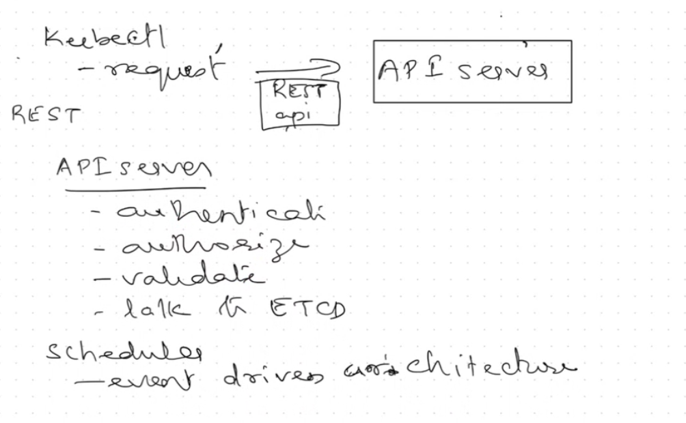
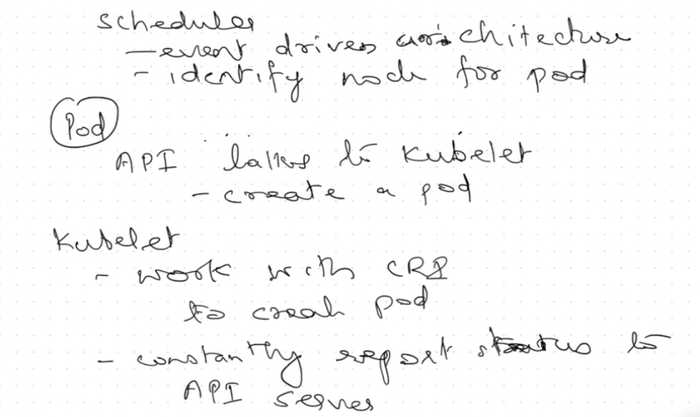

# Deep dive — Pods 

## PART I — My notes 
### Images





### What is a Pod?

* **Short definition :** a pod is a group of one or more containers.

* **Expanded:** A Pod is the smallest deployable unit in Kubernetes. It packages one or more containers that are meant to run together and share certain resources:

  * they share the **same network namespace** (they see the same `localhost` and share an IP),
  * they share **storage volumes** (mounted directories),
  * they share some IPC resources if required,
  * and they are **scheduled together** on the same node.

* **Typical pattern:** Most Pods contain a *single* container. When Pods contain multiple containers it is usually because of a *sidecar* pattern — a helper container that complements the main container (e.g., log collector, proxy, config reloader).

* **Co-located & co-scheduled:**

  * **Co-scheduled**: when the scheduler places the Pod, all containers inside it are created together.
  * **Co-located**: all containers run on the **same node**, in the same pod process and network environment.

---

### Practical — create a small cluster

 create a cluster with 1 master and 2 workers (three instances total). Typical kubeadm flow:

1. **Init control-plane on master**

   ```bash
   sudo kubeadm init
   ```

   * **What it does:** bootstraps the control plane components on this node (creates certificates, starts kube-apiserver, controller-manager, scheduler, and writes cluster config).
   * **When to use:** on the node you want to become the control plane (master).
   * **Note:** `kubeadm init` outputs a `kubeadm join ...` command that worker nodes use to join the cluster.

2. **If you lost the join command**

   ```bash
   kubeadm token create --print-join-command
   ```

   * **What it does:** prints a fresh `kubeadm join` command (creates token if necessary).
   * **When to use:** on the control plane when you need to re-generate the join command for worker nodes.

3. **Verify nodes (from any machine with kubeconfig pointing to API server)**

   ```bash
   kubectl get nodes
   ```

   * **What it does:** lists nodes and their status (Ready / NotReady).
   * **When to use:** after joining workers or troubleshooting.

---

### CNI / network plugin

* You noted that you need to install a network plugin. Kubernetes needs a CNI (Container Network Interface) plugin to set up Pod networking (IP allocation and veth, etc.).

* Example command :

  ```bash
  kubectl apply -f https://github.com/weaveworks/weave/releases/download/v2.8.1/weave-daemonset-k8s.yaml
  ```

  * **What it does:** installs Weave Net as a DaemonSet; each node runs a Weave pod to handle CNI networking.
  * **When to run:** after `kubeadm init` and before expecting pods to get Pod IPs and network connectivity.
  * **Alternative plugins:** Calico, Flannel, Cilium — each has its own manifest URL and configuration.

* **Watch pod status:**

  ```bash
  watch -n 1 kubectl get po -n kube-system
  ```

  * **What it does:** runs `kubectl get po -n kube-system` every 1 second so you can monitor system pods coming up.
  * **Stop watch:** CTRL-C.

---

### Service status checks shown in class

* **Check kubelet:**

  ```bash
  systemctl status kubelet
  ```

  * **What it shows:** whether kubelet (node agent) is active and its recent logs.

* **Check container runtime (example: CRI-O):**

  ```bash
  systemctl status crio
  ```

  * **What it shows:** whether the runtime is running. Kubernetes uses whatever runtime kubelet is configured with (containerd, CRI-O, etc.).

---

### Create pods 

* You used:

  ```bash
  kubectl run diptipod --image=nginx
  ```

  * **Explanation & cautions:**

    * Historically `kubectl run` created a Pod. In later `kubectl` versions the default behavior may create a Deployment unless you specify `--restart=Never` to force a plain Pod.
    * To **explicitly create a pod** use:

      ```bash
      kubectl run diptipod --image=nginx --restart=Never
      ```
    * Or better, for reproducible manifests, create a YAML and use `kubectl apply -f pod.yaml`.
  * **When to use:** quick test pod creation, demos. For production, use Deployment/StatefulSet/etc.

* Inspect pods:

  ```bash
  kubectl get pod -o wide
  ```

  * **Flags:**

    * `-o wide` shows node assignment, Pod IPs, and other extra columns.
  * **Alternatives:**

    * `kubectl get pods` (default).
    * `kubectl get pods -A` (all namespaces).

---

### Namespaces 

* **What they are:** logical partitions inside a cluster (virtual clusters). Useful to separate environments (dev, staging, prod), or teams.

* **Default namespaces created by Kubernetes (typical):**

  * `kube-system` — system components (coredns, kube-proxy, etc.)
  * `default` — your default working namespace
  * `kube-public` — readable by all (rarely used)
  * `kube-node-lease` — node heartbeats/lease objects

* Commands you used:

  * List namespaces:

    ```bash
    kubectl get ns
    ```
  * Create a namespace:

    ```bash
    kubectl create ns scaler
    ```
  * Create pod in namespace:

    ```bash
    kubectl run diptipod --image=nginx -n scaler --restart=Never
    ```
  * Show pods in a namespace:

    ```bash
    kubectl get po -n scaler
    ```
  * **Note:** `kubectl get po` without `-n` only shows pods in the current context namespace (default unless switched).

---

## PART II — Instructor notes


### Short definition 

A Pod is the smallest deployable unit in Kubernetes: one or more co-scheduled containers that share:

* the network namespace (same IP / localhost),
* IPC (if needed),
* volumes (shared mounts),
* and some other resources.

Pod objects are submitted to the API server, persisted to etcd, scheduled to a node by the Scheduler, then observed and enacted by the Kubelet on the node.

---

### Important Pod object fields (what is stored in etcd)

When a Pod is created, the following important pieces are stored:

* `metadata.uid` — unique id for the object
* `metadata.resourceVersion` — version for optimistic concurrency and watches
* `spec` — the desired spec: containers, initContainers, volumes, nodeName (empty until scheduled), tolerations, affinity, resource requests/limits
* `status` — current observed state: phase (Pending/Running/Failed), containerStatuses, podIP, conditions

These objects live under keys like `/registry/pods/<namespace>/<podName>` in etcd.

---

### Full creation flow — numbered & explained

#### Short sequence (high level)

1. `kubectl apply -f pod.yaml` → API server
2. API server: authN/authZ, admission controllers run
3. API server persists Pod to etcd (ADDED)
4. Scheduler sees unscheduled Pod → selects a Node → writes Binding (sets `spec.nodeName`)
5. API server persists binding to etcd (MODIFIED)
6. Kubelet on chosen node sees the assignment, enqueues Pod
7. Kubelet creates the Pod via CRI (pause/infra sandbox → pull images → run containers)
8. Kubelet updates Pod status in API (podIP, container status)
9. Readiness probe passes → Pod Ready → Endpoints updated for Services


#### Step 1 — Client submits Pod to API Server

* Example commands:

  * `kubectl apply -f mypod.yaml`
  * `kubectl create -f mypod.yaml`
  * `kubectl run mypod --image=nginx --restart=Never` (quick ad-hoc)

* **What happens:** `kubectl` makes an HTTP call (POST) to the API server to create the Pod resource.

* **When to use these:**

  * `apply` is best for declarative, repeatable deployments (keeps cluster state matching local YAML).
  * `create` is one-off create.
  * `run` is convenient for quick testing (but behavior may vary by `kubectl` version).

---

#### Step 2 — API Server: Authentication & Authorization

* **Authentication (authN):** validates *who* is making the request (certificate, token).
* **Authorization (authZ):** checks *what* the caller is allowed to do (RBAC).
* **If it fails:** you get 401/403 and Pod creation stops.

---

#### Step 3 — Admission controllers (mutating → validating)

* **Mutating admission controllers** can modify the object (inject sidecars, set defaults). Example: injecting an Istio sidecar.
* **Validating admission controllers** can accept or reject the object (e.g., PodSecurity policies).
* **Consequences:** The object stored in etcd might differ from the YAML you submitted after mutations.

---

#### Step 4 — API Server writes Pod to etcd

* The Pod object (as finally mutated/validated) is serialized and written to etcd under `/registry/pods/...`.
* The write is consistent; after success other components will see it.

---

#### Step 5 — API Server responds to client

* `kubectl` returns success, but the Pod is usually *unscheduled* at this point (no node assigned yet).

---

#### Step 6 — Scheduler notices unscheduled Pod

* Scheduler watches for Pods with `spec.nodeName == ""` and chooses a node using:

  * **Filtering (predicates):** eliminate nodes that cannot host the pod (insufficient resources, taints, missing volumes, port conflicts).
  * **Scoring:** rank remaining nodes for best fit (binpacking or spread).
  * **Priority / preemption:** if no fit, high-priority pods can preempt lower-priority ones.

---

#### Step 7 — Scheduler writes binding / sets `spec.nodeName`

* The scheduler writes the chosen node choice back into the Pod object (creates a Binding or patches `spec.nodeName`).
* This is persisted to etcd and triggers watch events.

---

#### Step 8 — Watchers receive the event (Kubelet sees assignment)

* Kubelet on the target node watches API and sees that a Pod object has `spec.nodeName` set to itself.
* Kubelet enqueues the pod for its sync loop.

---

#### Step 9 — Kubelet’s pod sync loop (create Pod)

Kubelet does many tasks in a particular order:

1. **Admission checks & local validation** (node features, volume availability).
2. **Prepare volumes**: talk to CSI or mount local volumes.
3. **Networking**: call CNI plugin to allocate Pod IP and set up veth pair and network namespace.
4. **Create Pod sandbox**: create the pause/infra container (holds netns).
5. **Pull images**: image pull via CRI image service.
6. **Create containers**: create and start all containers inside the pod in the correct order (init containers first).
7. **Run lifecycle hooks / postStart**.
8. **Update Pod status** (podIP, containerStatuses) back to the API server (status subresource).

* **Pause / infra container:** a small container that holds the network namespace and allows the pod’s containers to join that namespace.

---

#### Step 10 — Readiness & Liveness probes

* **Readiness probe:** if this fails, the Pod is not added to Service endpoints (so it won’t receive traffic).
* **Liveness probe:** if this fails repeatedly kubelet restarts the container according to `restartPolicy` (commonly `Always` for Deployments).
* These probes are configured in the Pod spec and used to signal health.

---

#### Step 11 — Controllers & Services reconcile and update state

* Controller managers (ReplicaSet, Deployment) watch the API and create more Pods if the desired replicas do not match actual.
* Service controller updates Endpoints/EndpointSlices based on pods that are Ready.

---

### What the kubelet reports back (status)

* `podIP` — the IP assigned by CNI
* `phase` — Pending/Running/Succeeded/Failed/Unknown
* `containerStatuses` — per-container state and restart counts
* `conditions` — `Ready`, `PodScheduled`, `Initialized`

---

### etcd details (why it matters)

* etcd stores the authoritative serialized object and is the source of truth.
* Each change increments `resourceVersion`. Components watch for changes using `resourceVersion`.
* `Status` updates are usually separate writes to avoid spec clobbering.

---

### Mutations & webhooks (additional note)

* Mutating webhooks can inject sidecars (e.g., service mesh) — this can change the final Pod spec.
* Validating webhooks can reject Pod creation (e.g., deny privileged containers).

---

### Networking and CNI (short)

* **CNI plugin** assigns Pod IPs and configures the veth pair / network namespace.
* **kube-proxy** programs iptables/ipvs rules to route Service IPs to Pod IPs.
* **DNS (CoreDNS)** watches services and endpoints and provides cluster DNS resolution.

---

### Storage and volumes (short)

* If Pod requests a `PersistentVolume` (PV), controllers create/attach the PV via CSI and kubelet mounts it before the Pod containers start.
* Volume attach/mount failures commonly cause Pod to remain in `ContainerCreating`.

---

### Lifecycle hooks, Init containers, termination

* **Init containers** run sequentially before app containers and must complete successfully.
* **PreStop** hooks are executed during graceful termination.
* Deleting a Pod sets a `deletionTimestamp` and kubelet sends SIGTERM to containers, waits for grace period, then SIGKILL if needed.
* **Finalizers** may delay deletion until cleanup steps complete.

---

### Pod states & conditions

* `phase` values: `Pending`, `Running`, `Succeeded`, `Failed`, `Unknown`.
* `conditions`: `PodScheduled`, `Ready`, `Initialized`, `Unschedulable`, etc.
* Kubelet & controllers update these fields.

---

### Race conditions & concurrency guards

* `resourceVersion` ensures optimistic concurrency; writes fail with `409` if out-of-date.
* `status` subresource separates frequent status writes from spec writes.
* Controllers use leader election (leases) to avoid split-brain.

---

### Debugging a Pod — useful commands & when to use them

* `kubectl get pods -A` — list all pods in all namespaces.
* `kubectl describe pod <pod> -n <ns>` — shows events and reasons (scheduling failures, image pull errors, CNI errors).
* `kubectl get pod <p> -o yaml` — shows full Pod object (spec + status).
* `kubectl get events -n <ns> --sort-by='.lastTimestamp'` — chronological events for troubleshooting.
* `kubectl logs <pod> -c <container>` — container logs. Add `--previous` for logs of the previous crashed container.
* `kubectl get pods -o wide` — shows node assignment + IP.
* `kubectl get nodes -o wide` — node capacities and addresses.
* To watch changes live:

  * `kubectl get pods --field-selector=status.phase=Pending -w`
  * `kubectl get pod <pod> -w`
* When you see common errors:

  * `ImagePullBackOff` → check image name, registry creds, `imagePullSecrets`
  * `CrashLoopBackOff` → check container logs & liveness probes
  * `ContainerCreating` stuck → check CNI logs and kubelet logs
  * `Pod Pending` → `kubectl describe pod` will show the 0/`N` nodes available reason (Insufficient cpu/memory, taints)

---

### Example trace (API calls summary — simplified)

1. `kubectl apply -f pod.yaml` → `POST /api/v1/namespaces/default/pods`
2. API server: authN/authZ → mutating webhook → validating webhook → write to etcd
3. Scheduler: sees unscheduled Pod → creates Binding to node
4. API server persists binding → watchers see event
5. Node kubelet sees Pod assigned → calls CNI to allocate IP → calls CRI to create sandbox → pulls images → starts containers
6. Kubelet patches Pod status with `podIP` and container states
7. Pod becomes Running and Ready after probes pass → Services updated

---

### Additional advanced notes (short)

* **Ephemeral containers**: attach temporary containers to a running Pod for debugging.
* **Scheduler plugins** allow custom scheduling logic.
* **Security**: use RBAC, Pod Security Admission (PSA), network policies, PSP alternatives.
* **Best practices**:

  * Use Deployments/ReplicaSets (not raw pods) for production.
  * Define resource requests/limits.
  * Use readiness/liveness probes.
  * Use PodDisruptionBudgets for controlled evictions.

---

## Commands summary with usage & flags

### `kubeadm init`

* Use: bootstrap the control plane on the master node.
* Typical flags: `--apiserver-advertise-address`, `--pod-network-cidr` (if required by your CNI).
* Example:

  ```bash
  sudo kubeadm init --apiserver-advertise-address=192.168.1.10 --pod-network-cidr=10.244.0.0/16
  ```

### `kubeadm token create --print-join-command`

* Use: generate the `kubeadm join` command for worker nodes.
* Output is used on worker nodes.

### `kubectl run <name> --image=... --restart=Never`

* Use: create a Pod quickly for a single-run container or testing.
* Flag `--restart=Never` ensures `kubectl run` creates a Pod; otherwise older versions may create a Deployment.

### `kubectl apply -f <file.yaml>`

* Use: declarative updates; use for manifests you keep in version control.
* `kubectl create -f` is imperative; `apply` is preferred for ongoing management.

### `kubectl get pod -o wide`

* Use: show Pod details including Node and IP.

### `kubectl get ns`

* Use: list namespaces.

### `kubectl create ns <name>`

* Use: create a namespace.

### `kubectl describe pod <pod> -n <ns>`

* Use: get detailed events, scheduling reasons, container statuses.

### `kubectl logs <pod> -c <container>`

* Use: fetch container logs. Add `--previous` to fetch logs from previous terminated container instance.

### `kubectl get pods -A` / `kubectl get pods -n <ns>`

* Use: get pods across all namespaces (`-A`) or in a specific namespace (`-n`).

### `kubectl get events -n <ns> --sort-by='.lastTimestamp'`

* Use: view chronological events for the namespace.

---

