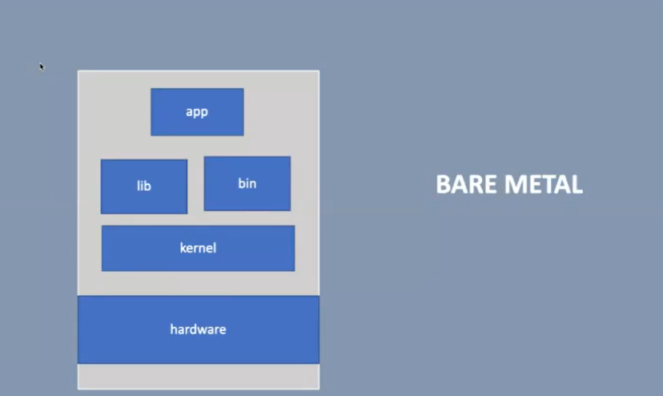
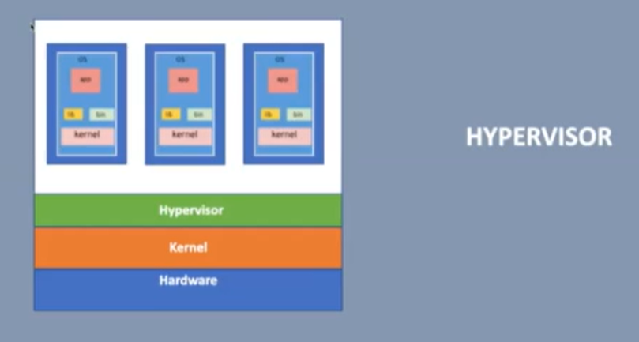
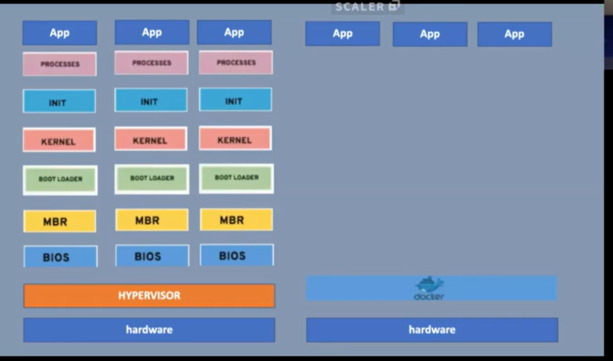
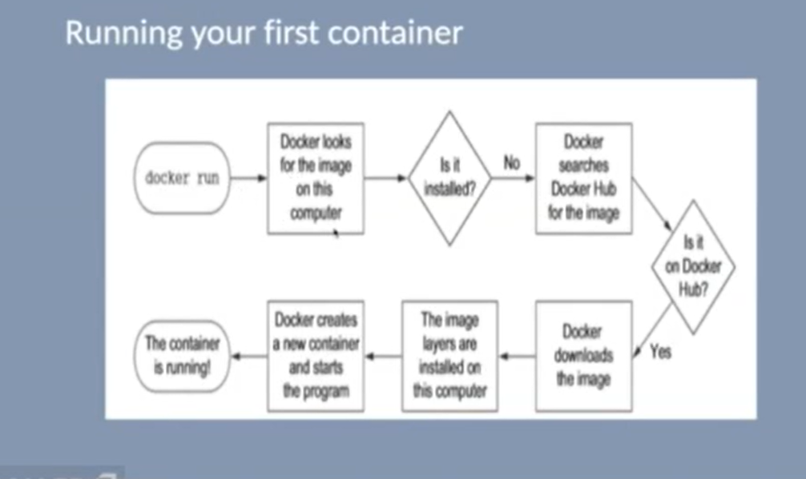
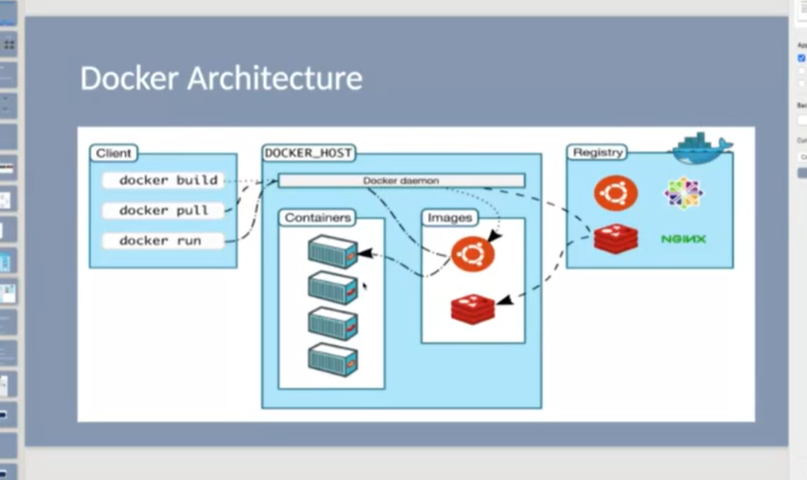

#  **1. Bare Metal Architecture**




###  **Explanation**

Bare metal means the application runs **directly on the hardware**, with no virtualization layer.

###  **Layers**

1. **Hardware** — CPU, RAM, Disk, I/O devices
2. **Kernel** — Core of OS: handles scheduling, memory, drivers
3. **Libraries (lib)** — Common shared code
4. **Binaries (bin)** — Essential executable files required by OS
5. **Application (app)** — Final running program

###  Key Point

There is **no Hypervisor**, no Virtualization.
Full performance.
But **only one OS** can run at a time.

---

#  **2. Hypervisor-Based Virtualization**


---

#  **What is a Hypervisor?**

A **Hypervisor** is a special category of software that allows you to create and run **multiple Virtual Machines** (VMs) on a single physical machine.

### **Hypervisor ka simple meaning:**

> Ek software jo hardware ko divide karke alag-alag virtual computers bana deta hai.

---

#  Types of Hypervisors

### **Type-1 Hypervisor (Bare Metal Hypervisor)**

* Directly installed on hardware
* No OS required underneath
* Most efficient
  Examples:
* VMware ESXi
* Microsoft Hyper-V
* Xen

### **Type-2 Hypervisor (Hosted Hypervisor)**

* Runs on top of the host OS
* Application ki tarah install hota hai
  Examples:
* VirtualBox
* VMware Workstation

---

# How Hypervisor Manages VMs

Each virtual machine has its own:

 Virtual CPU 

 Virtual RAM

 Virtual Disk

 Virtual Network

 **Its own Operating System**

 **Its own Kernel**

Meaning:
**A single laptop can run Windows + Linux + Ubuntu together.**

---

#  Why VMs Are Heavy?

Because **each VM boots its own full operating system** → That means:

* BIOS
* MBR
* Boot Loader
* Kernel
* INIT
* Processes

**ALL execute independently** for each VM.

---

#  **3. VM Boot Process (In Full Detail)**



Yeh diagram batata hai ki har ek VM ka boot process EXACTLY waise hi hota hai jaise ek normal computer ka.

---

#  Step-by-Step Boot Process 

 ### **1. BIOS (Basic Input Output System)**

* First thing that executes when the system turns on
* Hardware check karta hai
* Boot device choose karta hai

Example: Disk / USB / CD ROM.

---

 ### **2. MBR (Master Boot Record)**

* Disk ke first 512 bytes
* Contains:
   Partition table

   Information of installed Operating Systems

   Instructions of which OS to boot

---

### **3. Bootloader**

Responsible for loading the operating system.

Examples:

* **GRUB** (Linux)
* **Windows Boot Manager**

Hamare VM images apna dedicated bootloader use karte hain.

---

### **4. Kernel Loads**

* Kernel = Operating System ka engine
* Manages:

  Scheduling

   System Calls

   Memory
  
   Input–Output
  
   Hardware communication

---

### **5. INIT Process**

* First user-space process
* Starts all OS services
  Example:
* `systemd`
* `init`

---

### **6. RUNNING PROCESSES**

* Operating system services
* Applications
* Background jobs

---

#  Summary — Why is This Heavy?

Because EVERY VM repeats ALL of these steps independently.

**Multiple VMs → Multiple full OS boot cycles → Slow and heavy.**

---

#  **4. Docker vs VM Boot Process**


---

#  **How Docker Works Instead**

Docker **DOES NOT HAVE**:

 BIOS

 MBR

 Bootloader

 Kernel (does not ship its own kernel)

 Full OS

###  Docker uses **Host OS Kernel** directly

Isliye container setup is:

```
Hardware → Host OS Kernel → Docker Engine → Containers
```

---

##  **Docker Container Startup**

When you run:

```bash
docker run nginx
```

Docker simply:

1. Uses existing kernel
2. Creates an isolated filesystem
3. Mounts libraries + binaries
4. Starts the application process directly

### Startup time: **Milliseconds**

**No boot sequence. No separate OS. No heavy kernel.**

---

#  **5. Why Docker Is Lightweight?**

Because:

 No OS boot

 No separate kernel

 Only one kernel for all containers

 Only app + dependencies

 Startup is INSTANT

 Very small image sizes

---

#  **6. Docker Run Flow**


#  Detailed Explanation of Flow

### **Step 1: User runs:**

```bash
docker run <image-name>
```

### **Step 2: Docker Client → Docker Daemon**

Client sends instruction to Docker Engine.

### **Step 3: Docker checks local image**

If image exists → use it
Else → go to Docker Hub

### **Step 4: Download image layers**

Images have multiple layers based on Union FS.

### **Step 5: Docker creates a container**

Container =

* isolated filesystem
* isolated network
* isolated process tree
* but SHARES kernel

### **Step 6: Container starts instantly**

No OS boot.
Application starts immediately.

---

# 7. Docker Architecture




#  1. Docker Client

The commands you run:

* `docker build`
* `docker pull`
* `docker run`
* `docker ps`

Client sends request to Docker Daemon using REST API.

---

#  2. Docker Daemon (`dockerd`)

The **brain** of Docker.

Responsible for:

* Building images
* Running containers
* Stopping containers
* Storing images
* Networking
* Volume management

Daemon listens for commands and executes them.

---

# 3. Docker Host

Contains:

* **Images**
* **Containers**
* **Storage**
* **Networking**

---

# 4. Docker Registry (Docker Hub)

Used for pulling/pushing images:

* Ubuntu
* Nginx
* Redis
* Node.js
* Custom user images

---

#  How Images & Containers Work Together

* **Image** = read-only template
* **Container** = image + runtime environment
* Many containers can be created from a single image

---

#  **8. Installing Docker**

```bash
sudo su
curl -fsSL https://get.docker.com -o get-docker.sh
sudo sh get-docker.sh
docker run hello-world
```

---

#  **9. Important Docker Commands**

###  List running containers

```bash
docker ps
```

###  List running + stopped containers

```bash
docker ps -a
```

---

# Running Nginx container

Foreground:

```bash
docker run nginx
```

Detached mode:

```bash
docker run -d nginx
```

---

#  Find container IP

```bash
docker container inspect <id>
```

---

#  Enter a running container

```bash
docker exec -it <id> bash
```

---

#  Create & enter new container

```bash
docker run -it ubuntu bash
```

---

#  Start stopped container

```bash
docker start <id>
docker exec -it <id> bash
```

---

#  Docker Hub Login

```bash
docker login -u <username>
```

---

# Create image from container

```bash
docker commit -m "message" <container-id> <username>/<imagename>
```

Check:

```bash
docker images
```

Push:

```bash
docker push <username>/<imagename>
```

Remove:

```bash
docker rmi <image-id>
```

---

